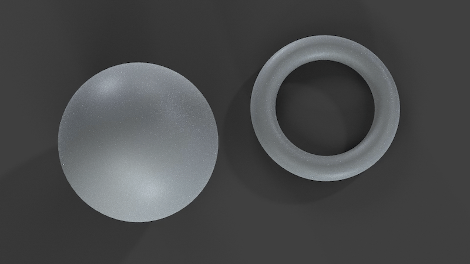
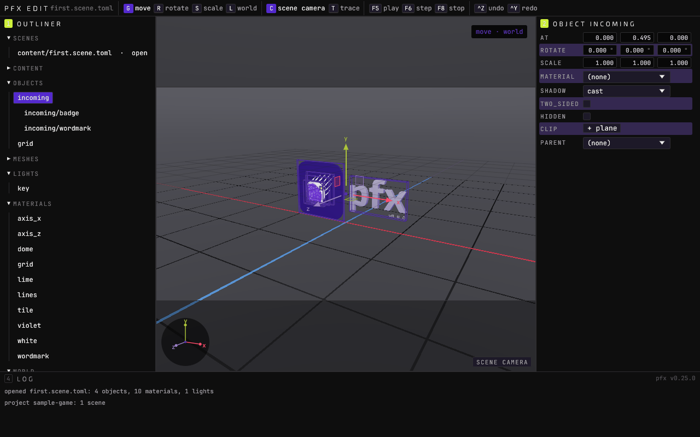
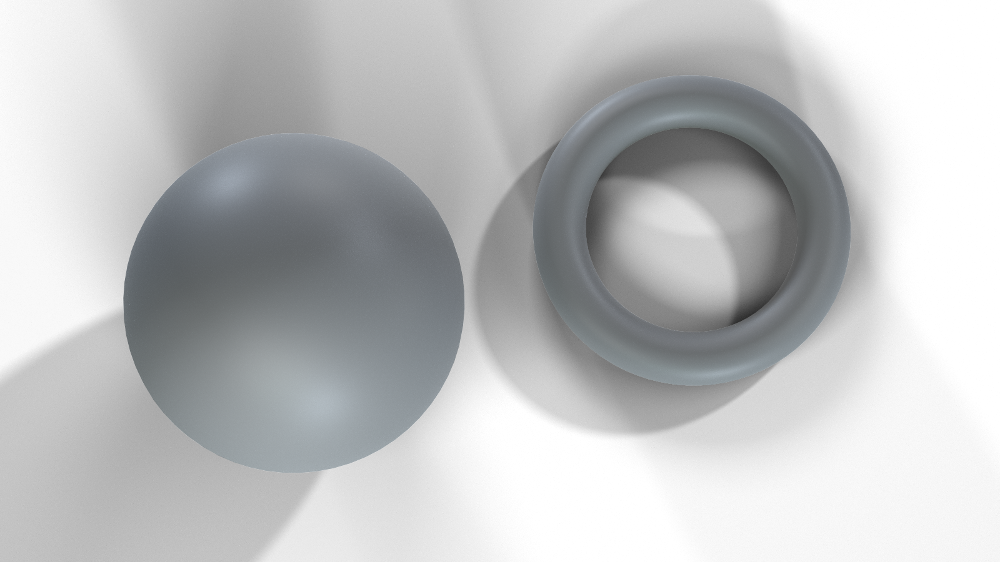

<p align="center"></p>

# pfx

[](https://github.com/gmrdad82/pfx/actions/workflows/ci.yml) [](https://github.com/gmrdad82/pfx/tags)

pfx is a game and render engine in Rust: a live renderer for 60 fps at 4K, an offline path tracer, physics, sound, input, mods and a scene editor, with scenes kept as plain TOML files.

<p align="center"></p>

`pfx edit` on the game `pfx new` scaffolds, captured by the editor's offscreen harness.

## What it is

pfx is the engine under the PITO games and apps, built as a set of crates a game links and one command-line tool, `pfx`. It is generic: no game keeps its names, values or assets in it; each game owns its content and uses the engine.

- **Games.** `pfx new <game>` scaffolds a repository with one binary: it plays the game, and `<game> edit` opens it in the editor. `pfx-game` runs the window, pacing, input, sound and a fixed tick in one call, and the game implements one trait ([docs/game.md](docs/game.md), [docs/projects.md](docs/projects.md)).
- **Scenes as data.** Scenes, materials and prefabs are TOML in the [pfx-scene](https://github.com/gmrdad82/pfx-scene) format, edited in place by the editor and reloaded live while a game plays ([docs/scenes.md](docs/scenes.md)).
- **Rendering.** The live renderer keeps a steady 60 fps at 4K with shadows, baked light, TAA, text from vector outlines and dynamic resolution ([docs/live-renderer.md](docs/live-renderer.md)); the path tracer renders stills, clips and the light bake ([docs/trace.md](docs/trace.md), [docs/bake.md](docs/bake.md)).
- **The rest of a game.** Rigid bodies, characters and world queries ([docs/physics.md](docs/physics.md)), mixing and streams ([docs/sound.md](docs/sound.md)), keyboard, mouse and controllers behind one action map ([docs/input.md](docs/input.md)), sandboxed WASM mods ([docs/mods.md](docs/mods.md)), and Steam ([docs/steam.md](docs/steam.md)).
- **Deterministic.** The same scene, inputs and seed give the same frames on the same GPU and driver, and a game's rules can run bit for bit from their seed ([docs/sim.md](docs/sim.md)).

It is for people and AI agents who build games and real-time scenes as code and text. It runs on Linux with a Vulkan GPU; games also build for Windows, and run on the Steam Deck through Proton ([docs/windows.md](docs/windows.md)).

## Install

```
cargo install --locked --git https://github.com/gmrdad82/pfx --tag vX.Y.Z pfx
```

Replace `vX.Y.Z` with a [release](https://github.com/gmrdad82/pfx/releases) tag. Building needs Rust 1.97 or newer and, on Debian or Ubuntu, `libasound2-dev libudev-dev libxkbcommon-dev libwayland-dev libx11-dev`.

A game depends on the crates it uses by the same tag:

```toml
pfx-game = { git = "https://github.com/gmrdad82/pfx", tag = "vX.Y.Z" }
```

## Use

Make a game in a fresh repository, play it, and open it in the editor:

```
git init my-game
pfx new my-game
cd my-game
cargo run --release
cargo run --release -- edit
```

The game is a type that implements `pfx_game::Game`, and `main` hands it to the launcher:

```rust
use pfx_game::{Config, Game, Input, Tick, World};

struct MyGame;

impl Game for MyGame {
    fn start(&mut self, _world: &mut World) {}

    fn tick(&mut self, _world: &mut World, _tick: &Tick, _input: &Input) {}
}

fn main() -> std::process::ExitCode {
    let config = Config::new("my-game", env!("CARGO_PKG_VERSION"), "content/first.scene.toml");
    pfx_game::launch(|| MyGame, config, |_commands| {})
}
```

The `pfx` tool's other commands:

```
pfx edit <scene.toml | project folder>   the scene editor
pfx bench <scene.toml> --seconds 10      a repeatable headless load with frame stats
pfx bake --scene <dir>                   path-traced probes, lightmaps and plates
pfx render --scene <shot> --product <product> --still
pfx steam stage --manifest <game>/steam.toml --out tmp/steam
pfx scene migrate|fix <scene.toml>
pfx --help
```

<p align="center"></p>

The engine's neutral sample shot, path-traced in this checkout by `pfx render --scene shapes --product sample --still --recipes crates/assets/tests/recipes` ([crates/assets/README.md](crates/assets/README.md)).

## The crates

Each is a package in this workspace that a game or app can link by tag:

| Package | What it does |
|---|---|
| `pfx-core` | springs, easings and tweens ([docs/easings.md](docs/easings.md)); daylight and the sun; camera rigs and animation; deterministic maths |
| `pfx-geom` | levels of detail, analytic shapes as meshes, deformable surfaces, SVG marks as bevelled solids |
| `pfx-gpu` | the wgpu device, offscreen targets, readback and uploads, GPU timing and pacing; windows and screens behind `window` |
| `pfx-materials` | one physically based material for both renderers, with ageing and a WGSL BSDF library |
| `pfx-text` | glyphs from vector outlines (coverage and MSDF atlases), laid along any baseline |
| `pfx-post` | the finish chain (tone map, bloom, grade, vignette, grain, dither) and image styles |
| `pfx-load` | meshes, images, HDR skies and fonts, scenes in pfx-scene's format with in-place edits, and a content-addressed cache |
| `pfx-physics` | rigid bodies, character controllers and world queries, fluid, ripples, rope, flocks and wind |
| `pfx-sound` | live mixing, decoded streams and deterministic mixdown |
| `pfx-input` | keyboard, mouse and controllers behind one action map, glyphs, keycaps in the player's layout, rumble and recording |
| `pfx-steam` | achievements, stats, Cloud saves, the overlay, rich presence, leaderboards, lobbies and Steam Input |
| `pfx-live` | the live renderer: shadows, baked light, TAA, text, effects, the flat 2D pass, frames on demand, dynamic resolution and the dev HUD |
| `pfx-trace` | the offline path tracer |
| `pfx-bake` | path-traced light the live renderer shows at raster cost: probe grids, lightmaps and plates |
| `pfx-play` | play mode: a game run live over a runtime copy of a scene, with pause, step and an exact stop |
| `pfx-game` | the game runtime and its command-line launcher |
| `pfx-project` | a game's `project.toml`, scenes and content folders, and `pfx new`'s scaffold |
| `pfx-mod` | the mod host: sandboxed, deterministic WASM components, metered by fuel and capped in memory |
| `pfx-editor` | `pfx edit` and `<game> edit`: the scene editor, with play in the viewport and live gameplay modules |
| `pfx-editor-style`, `-shell`, `-doc`, `-toml`, `-viewport` | the egui crates editors on pfx share: a theme and its widgets, a window host with an offscreen shot harness, document edits on one undo history, a TOML source panel and a 3D scene viewport with picking and a gizmo ([docs/editor-crates.md](docs/editor-crates.md)) |
| `pfx-theme` | the colours, fonts and type the editor and the dev HUD paint with |
| `pfx-bench` | `pfx bench` |
| `pfx-assets` | path-traced renders of logos, icons and scenes from SVG masters and small specs |
| `pfx-run` | the `pfx` tool's process plumbing: GPU queueing, ending children cleanly and the pinned ffmpeg |

## Build and test

```
cargo build --release
bin/gate
```

`bin/gate` is what CI runs: formatting, clippy with warnings as errors, the binaries and examples, the unit tests, the check that keeps game content out of the engine ([docs/agnostic.md](docs/agnostic.md)) and the licence check of every dependency. The GPU tests are `#[ignore]`d and need a GPU: run a crate's with `cargo test -p <crate> -- --ignored`. `bin/windows-check test` builds the game crates for Windows and runs their tests under Wine.

## Contributing

Issues and pull requests are welcome at [github.com/gmrdad82/pfx](https://github.com/gmrdad82/pfx). Keep `bin/gate` green, keep game-specific names, values and assets out of the engine, and follow the [code of conduct](CODE_OF_CONDUCT.md). Report a vulnerability privately, as [SECURITY.md](SECURITY.md) says.

## Licence

The code is MIT licensed, © Catalin Ilinca ([LICENSE](LICENSE)). The MIT licence covers the code only: the PITO name, every app and game name and their logos are © Catalin Ilinca, all rights reserved ([TRADEMARKS.md](TRADEMARKS.md)). Fonts and other media keep their own licences ([NOTICE.md](NOTICE.md)).

More at [pitomd.com](https://pitomd.com).
