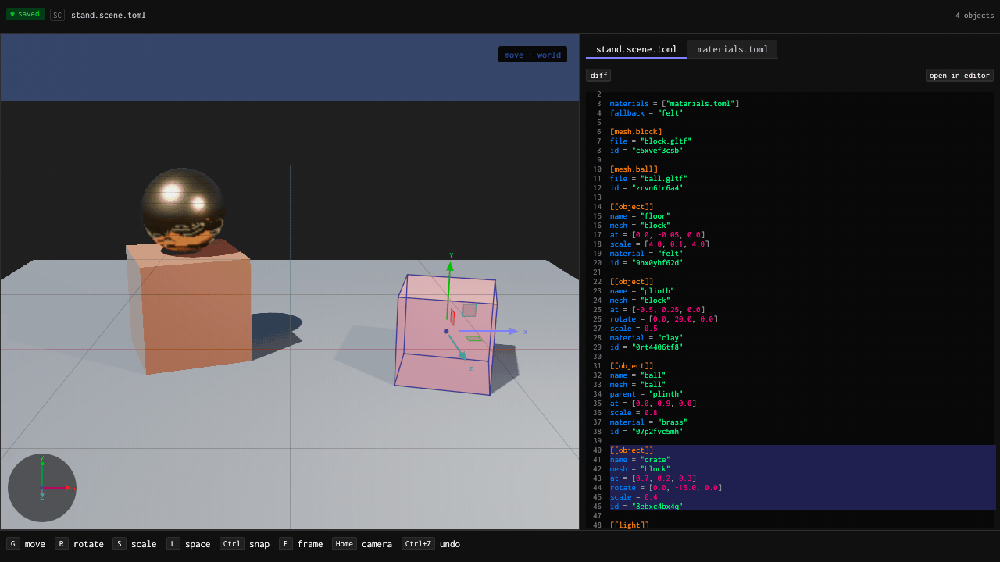
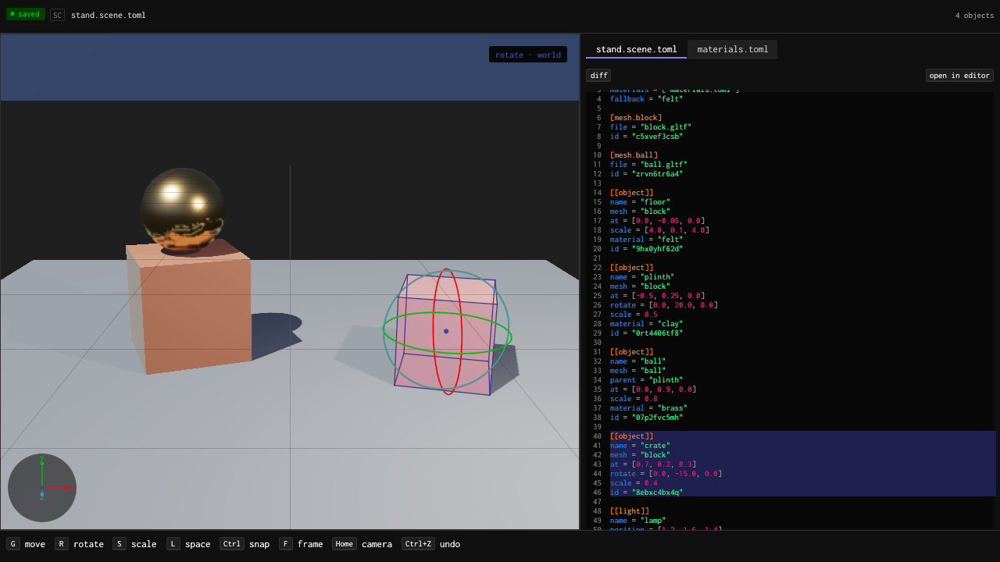

# The editor crates



Five egui crates hold what every editor built on pfx shares, so `pfx edit` and other editors on the engine look and behave as one: a theme and its widgets, a window host with an offscreen shot harness, an embedded TOML source panel, document edits on one undo history, and a 3D viewport with a camera, picking and a gizmo. They hold nothing of any one editor: no colours, no fonts and no app logic. An editor brings its own theme; pfx's is `pfx-theme` (`docs/editor.md`, "The look").

## The crates

| Crate | Folder | Holds |
|---|---|---|
| `pfx-editor-style` | `crates/editor-style` | The `Theme` every widget paints from (colour roles, syntax and diff colours, metrics, a body face and an optional display face, title and label caps), `theme::apply_theme` to install one and `Theme::of` to read it back, and the widgets: header, tabs, pill, keycap, number field and dotted rule. |
| `pfx-editor-shell` | `crates/editor-shell` | The `App` trait an editor implements; the native window host (winit and egui-wgpu on the engine's GPU, redrawn on demand, with a file watch); an offscreen shot harness driven by a typed input script, for tests and screenshots; panel focus chords, the egui painter and a background worker. When a `pgpu` GPU-queue command is on `PATH`, the host reads its status and paces its GPU work by it; without one, nothing changes. |
| `pfx-editor-doc` | `crates/editor-doc` | The `Edit` trait every edit implements; `Files`, the open texts with a TOML document kept in step; dotted-path TOML patches (set, unset, push, remove) that keep the author's text, with their inverses; text splices, comment toggling and groups; one labelled undo history with a depth limit and typing merges; and stamped saves that tell the app's own writes from outside changes. |
| `pfx-editor-toml` | `crates/editor-toml` | The embedded TOML source panel: a tolerant lexer with incremental re-lex, a highlighted editor with a line gutter, live editing that parses after 150 ms, checks through the app's `Check` and applies as one undoable splice, with wavy underlines and a problems list. It follows outside changes with the caret kept, toggles comments with Ctrl+/, diffs the buffer against the saved file or git HEAD with a one-click revert per hunk, and opens the file in `$VISUAL` or `$EDITOR`. |
| `pfx-editor-viewport` | `crates/editor-viewport` | A `Viewport` an app puts in a panel: a pfx `scene.toml` drawn by the engine's live renderer, on demand, with an orbit camera (drag to orbit, Shift or the middle button to pan, the wheel to dolly, the arrows, + and −, F to frame, Home to look through the scene's camera), picking by the engine's id buffer, the selection's outline, and move, rotate and scale handles (G, R, S; L for world or local, Ctrl to snap, Escape to drop) whose drag previews in memory and commits once, on release, as one undoable scene edit. The scene reloads when another program writes it, and the viewport's own writes never reload twice. |

They are workspace crates like the rest of pfx, at its version and tag, and take `pfx-gpu`, `pfx-live` and `pfx-load` by path, so a build holds one copy of each engine crate. An editor outside this repository takes them from git at the same tag as its other pfx crates:

```toml
[dependencies]
pfx-editor-shell = { git = "https://github.com/gmrdad82/pfx.git", tag = "<tag>" }
pfx-editor-toml = { git = "https://github.com/gmrdad82/pfx.git", tag = "<tag>" }
pfx-editor-viewport = { git = "https://github.com/gmrdad82/pfx.git", tag = "<tag>" }
```

They build on egui 0.33.3 and wgpu 27; an app adds `egui = "=0.33.3"` for its own panels.

## Use

An editor implements `App` and hands it to the window host. This one edits a TOML file with the source panel and saves each applied change:

```rust
use std::path::Path;

use pfx_editor_doc::{Files, History};
use pfx_editor_shell::{App, Theme, window};
use pfx_editor_toml::{NoCheck, Source};

struct Settings {
    source: Source,
    files: Files,
    history: History,
    theme: Theme,
}

impl App for Settings {
    fn ui(&mut self, ctx: &egui::Context) {
        egui::CentralPanel::default().show(ctx, |ui| {
            let changed = self.source.show(ui, &mut self.files, &mut self.history, &NoCheck, &mut |_, _| {});
            for file in changed.iter().flat_map(|changed| &changed.files) {
                let _ = self.files.save(file);
            }
        });
    }

    fn theme(&self) -> Theme {
        self.theme.clone()
    }
}

fn main() -> Result<(), Box<dyn std::error::Error>> {
    let path = Path::new("settings.toml");
    let mut files = Files::new();
    files.load(path)?;
    let source = Source::new("settings", path);
    let theme = my_theme();
    window(Settings { source, files, history: History::default(), theme }, None)?;
    Ok(())
}
```

`my_theme()` is yours: a `Theme` holds the app's colours, metrics and the bytes of its font files, which the app keeps, with their licences, in its own tree. The crates' test theme, `crates/editor-style/src/fixture.rs`, is a complete one.

## The editor example

`crates/editor-viewport/examples/editor.rs` puts every crate together in about 300 lines: a viewport, a tab of TOML source for each of the scene's files, a header, pills and keycaps. A gizmo drag commits to the file and the source follows; an edit in the source saves and the viewport reloads; Ctrl+Z undoes either.

```sh
cargo run -p pfx-editor-viewport --example editor                  # a copy of the sample scene
cargo run -p pfx-editor-viewport --example editor -- my.scene.toml
cargo run -p pfx-editor-viewport --example editor -- --select crate --shot editor.png
```

`--shot` draws the editor offscreen into a PNG instead of opening a window, and `--input <file>` drives it first with the shell's input script (`move x y`, `click x y`, `press x y`, `release x y`, `drag x1 y1 x2 y2`, `key R`, `text …`, `frame`).



The pictures use the crates' test theme and the viewport tests' sample scene.

## Tests

Each crate's unit and integration tests run in the gate. Tests that need a GPU are `#[ignore]`d and run under pgpu with the rest of the engine's GPU suites. They write under the workspace's `tmp/`. The test font, Inconsolata in `crates/editor-style/fixture`, is under the SIL Open Font License, with its `OFL.txt` and `SOURCE` beside it; no app takes it as its look.

The crates are edition 2024, have no `unsafe`, and never read the clock or system randomness outside the window host.
